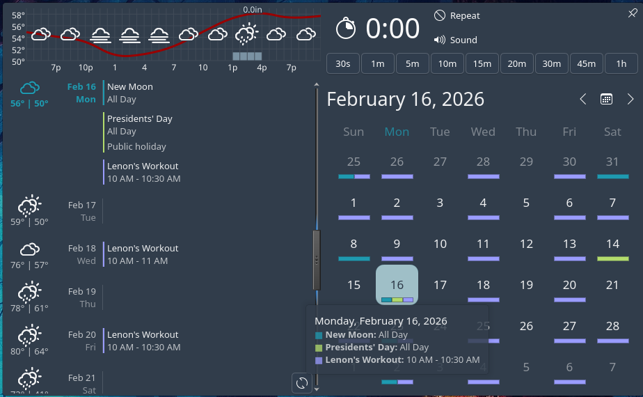
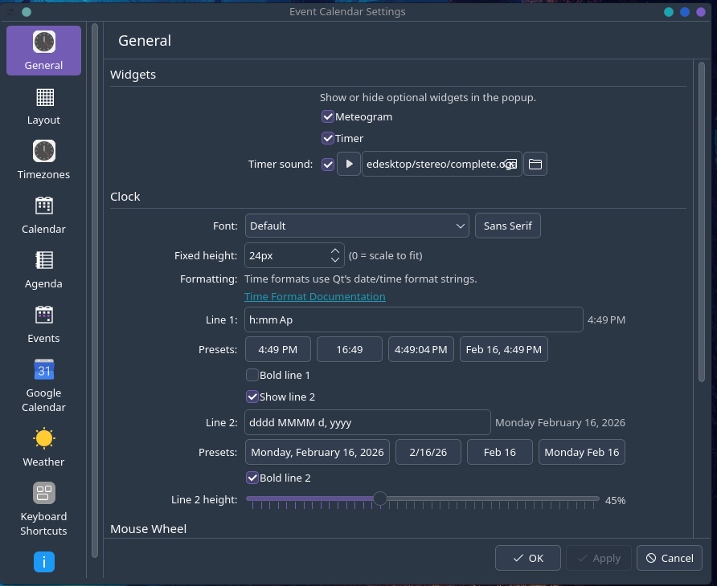
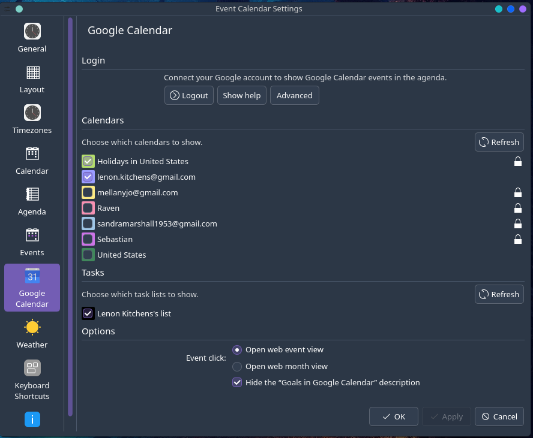
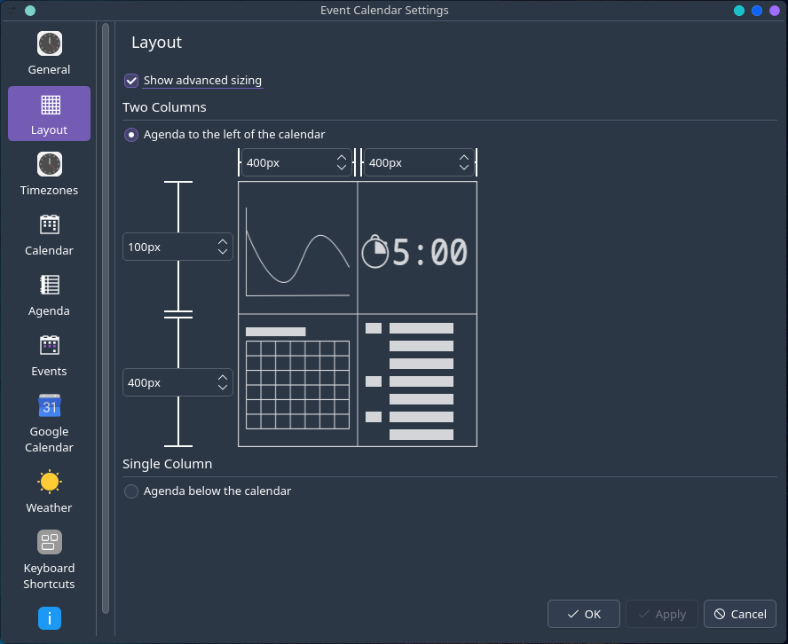

# Plasma 6 Event Calendar

A modern **Plasma 6** port and substantial rewrite of the classic Event Calendar plasmoid.

This widget combines:

- Calendar + month grid
- Agenda / upcoming events
- Tasks integration
- Weather integration
- Optional Google Calendar sync

## Credits

This project is based on the original **Event Calendar** by **Chris Holland (Zren)**.

- Original repository: <https://github.com/Zren/plasma-applet-eventcalendar>
- Original KDE Store page: <https://store.kde.org/p/998901/>

Huge credit to Zren/Chris Holland for creating and maintaining the original applet that this port builds upon.

## Screenshots






## Installation

### Option A: Build & install (system-wide)

This installs system-wide (typically under `/usr`) and requires `sudo` for installation.

```bash
git clone https://github.com/lenonk/plasma6-applet-eventcalendar.git
cd plasma6-applet-eventcalendar
cmake -S . -B build -DCMAKE_INSTALL_PREFIX=/usr
cmake --build build
sudo cmake --install build
```

### Option B: Install using included script (user-level)

This installs for the current user (no system-wide files), which is convenient for local testing and development.

```bash
git clone https://github.com/lenonk/plasma6-applet-eventcalendar.git
cd plasma6-applet-eventcalendar
sh ./install
```

### Option C: Arch Linux (AUR)

Also available in the AUR as:

- `plasma6-applets-eventcalendar`

You can install it with your preferred AUR helper, for example:

```bash
yay -S plasma6-applets-eventcalendar
```

## Updating

```bash
sh ./update
```

This pulls the latest changes and reinstalls the applet.

## Uninstall

```bash
sh ./uninstall
```

## Configuration

After installing:

1. Open the widget settings for Event Calendar.
2. Configure calendar providers (local / Google) as needed.
3. Configure weather provider (Open-Meteo) and location.
4. Apply changes.

### Google Calendar setup

1. Open **Event Calendar Settings → Google Calendar**.
2. Enter your Google OAuth Client ID (and optional Client Secret).
3. Click **Login in Browser** and complete authentication.
4. Click **Apply**.

## Notes

- This is a community-maintained Plasma 6 continuation/port.
- If you are migrating from older Plasma 5 builds, review settings after upgrade.

## License

See project license files and upstream licensing notes from the original project.
